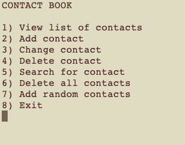
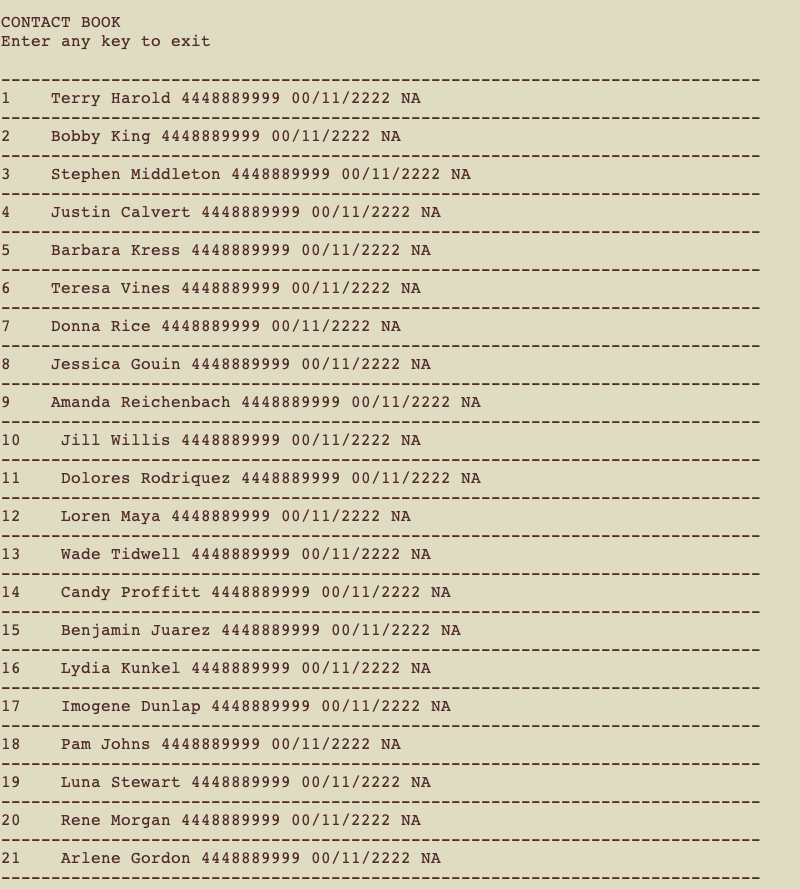

Contact Book [Python]
---------------------------

**WIP**

Simple method to store contacts (name, phone number, birthday, address). Includes random contact generator functionality in which the user 
can select a number of random contacts to be added to the contact book. Used random name generator from: https://github.com/treyhunner/names
 

To view project
-------------------- 
- download zip
- navigate to downloaded folder using command line interface (terminal)
- to open project, use command: python start.py
- note: you must have python installed

Screenshots
--------------------------
Examples of different features of the contact book

**Start Menu**

Contact book includes functionality such as adding/removing contact, adding random contacts, searching a contact, deleting all contacts, etc

**Contact Book**
Shows view of some of the contacts in the contact book. These contacts were each made using the random name generator

